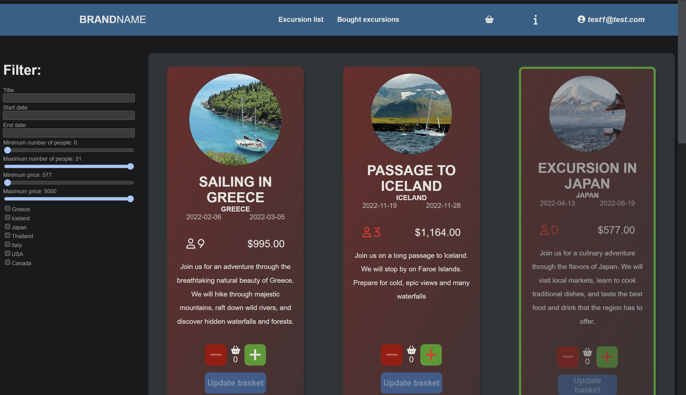
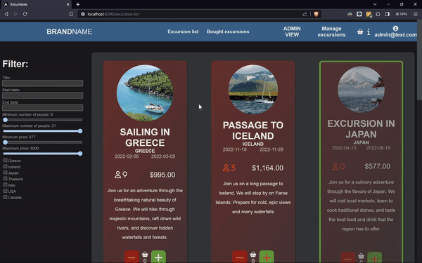
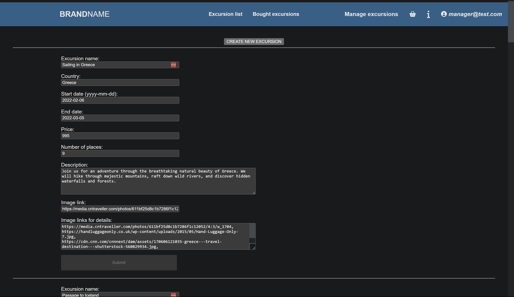
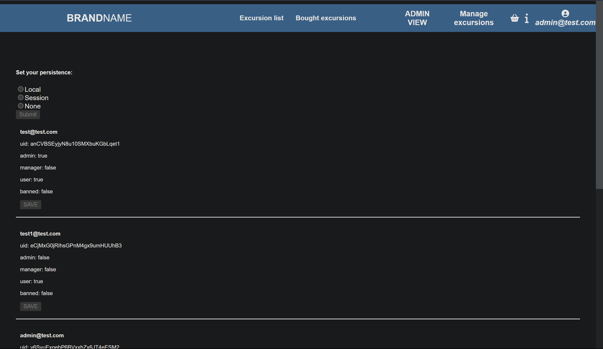

# Excursions

This project was made as a part of Wstęp do Aplikacji Internetowych (Introduction to Web Applications) course on AGH University.

## Description

Excursions is a web store that allows users to:

- browse excursions
- filter excursions
- enter the excursion page
- leave reviews on the excursion page
- buy excursions

Users can create an account using their email address. Every user has access to their purchase history.

There are three types of user

- standard user
- manager
  - is able to create and edit excursions from manager pannel
- admin
  - is able to manage users acconuts:
  - make user an admin
  - make user a manager
  - ban users

## Technologies used

I used Angular as the application framework and Firebase as a database and authorization service.

## Screenshots

